# Web Connection Security

<div style="margin: 20px 0;font-size: 0.8em">

*Prepared for:* **Southwest Fox**  
*October 2018*

</div>

Security should be on every Web developer's mind when building a new Web application or enhancing an existing one. Not a day goes by that we don't hear about another security breach on some big Web site with scads of customer data compromised.

## Security is hard
Managing Web site security is never easy as there are a lot of different attack vectors and if you are new to Web development it's very easy to miss even simple security precautions. 

The good news is that the majority of security issues can be thwarted by a handful of good practices which I'll cover in this paper. But keep in mind that this is not all the things that can go wrong. I'm no security expert either but I've been around Web applications long enough to have seen most of the common attack vectors and know how to deal with them. But that's not to say that I have all the answers and this paper isn't meant to be an end all security document. If you are serious about security you should look at specific courses that deal explicitly with Web security, or even go as far as hiring a security specialist that can assess the state of security of your Web site.

Security is also an ongoing topic, something that needs to be kept up with. Attack vectors change over time, as do the tools you use to build and run your Web sites. 

The main takeaway from this short introduction is that Security is serious business and you should think about it right from the moment you start building your application, while you are adding new features and when it is up and running even when it is 'done'. Be vigilant.

## Web Connection and Security
West Wind Web Connection is a generic Web framework that provides an interface for FoxPro to interact with a Web Server - IIS Primarily - on Windows. Web Connection provides a rudimentary set of security features, but it is not and never was intended as a complete security solution. 

Part of this is because the majority of security related issues have little to do with the actual application itself and deal more with network management and IT administration. 

The focus of this paper is on the things that are important to a Web Connection application and that you as a developer using Web Connection and building a Web application have to think about.

Here's what I'm going to cover:

* Web Security
	* Web Server Security - IIS
	* TLS Encryption
	* Authentication
* Physical Access & Network
	* Who can get at the box?
	* Who can hack into the system
	* File system Permissions
	* Web Application Identity
* Operating System
	* Who can access files on the machine
* Middleware Technology
	* Who can hi-jack the application
	* Spoofing

## Web Server and Site Security
The first step is making sure that your Web Server and your Web Site are secure. Most of the issues around this are related to setup configuration of IIS and the specific Web site you are creating.

### IIS Security
The first line of defense involves the Web Server which in most cases for a Web Connection application will be Microsoft's built-in IIS server. IIS 7 and later is secure by default which means that when you install the Web Server it actually installs with very minimal features. The base install basically can serve static files and nothing more.

In order to configure IIS for Web applications and Web applications specifically you need to add a number of additional components that enable ASP.NET and or ISAPI, Authentication and some of the Administration features.

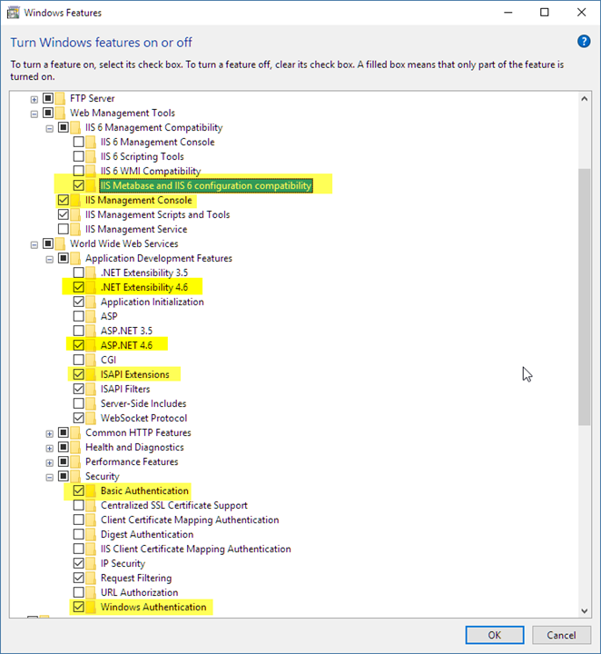

<small>**Figure 1** - Core features required for a Web Connection IIS installation</small>

The key things are:

* **ASP.NET or ISAPI**    
These are the connector interfaces that connects Web Connection to IIS. **You only need one or the other to run**, but both are supported in Web Connection and can be switched with simple configuration settings. The .NET module is the preferred mechanism which sports the most up to date code base and much more sophisticated administration features.

* **Authentication**  
In order to access the Web Connection administrative features and to perform the default admin folder blocking, Web Connection uses default Windows authentication. If you use .NET you only need to install Windows Authentication, but Basic Authentication can also be used. Both of these auth mechanisms are tied to Windows user accounts. Web Connection also provides application level security features that are separate from either of these mechanisms (more on that later).

* **IIS Management**    
In order for the Web Connection tools to configure IIS you need to have the IIS Management tools enabled, so you need to ensure the IIS Management Console is installed as well as the IIS 6 Metabase compatibility feature, which is a COM/ADS based IIS adminstration interface that's used by most tools.

### How IIS and Web Connection Interact
A key perspective for understanding IIS Web Security from an application execution perspective is to understand how IIS and your Web Connection use **Windows Identity** while the application is executing. 

#### It's all about Identity
The Windows Identity deteremines the rights that your application has on the Windows machine it is running on. A Web application's requests transfer through a number of Windows processes and each one has a specific Identity assigned to it. 

Identity is crucial to system security because it determines what your Web application can access on the local machine and potentially on the network. The higher the access rights, the higher risk that **if** your application is compromised that some damage can be inflicted on the entire machine. The key is is **if your application is compromised**.

There's an inverse relationship between how secure your application is and how much effort you have to put in to use more limited accounts. Using a high permissions account like SYSTEM or an Admin account lets your application freely access the entire machine, but it if there ever is a problem it also lets a hacker access your entire machine freely. If you choose to run under a more limited security scheme you have to **explicitly** expose each location on disk and the possibly the network that the application has access to.

Realize that clamping down security may not help you prevent access to data that your application uses anyway in case of an attack. Your application needs to have access, so in case of a security compromise that means a potential hacker also has access. Still, it's a good idea to minimize rights as much as possible by using a lower rights account and explicitly setting access where it's needed.

> #### @icon-warning Web Connection Uses SYSTEM by Default: Change it for Production
> When a new Web Connection application is created, Web Connection by default sets the Identity to SYSTEM which is a full access account on Windows. WWWC does this because SYSTEM is the only generic account in Windows that has the rights to **just work** out of the box when running in COM mode. Any other account requires some configuration. The setup routines are meant to configure a development machine initially and are not meant for production. For production choose a specific account, or NETWORK SERVICE and provide explicit system rights required by your application.


#### IIS and FoxPro
Let's drill in a little closer to understand where Identity applies. For IIS and Web Connection there are two different processes that you are concerned with and each can, but doesn't have to, have it's own process Identity:

* The IIS Application Pool
* Your FoxPro Exe Server

For Web Connection both are separate EXEs and each can have their own identity. 

> #### @icon-info-circle Use Launching User Passthrough Identity for FoxPro Server
> I recommend you **never explicitly set the identity of your FoxPro EXE** (in DCOMCnfg), but rather use the default, pass-through security of the **Launching User** that is used when custom DCOM Identity is applied. By doing so you only need to worry about the Identity of the Application Pool and not that of your FoxPro EXE.

#### The Process and Identity Hierachy
**Figure 2** shows the different processes that are involved when running an IIS Web Server:

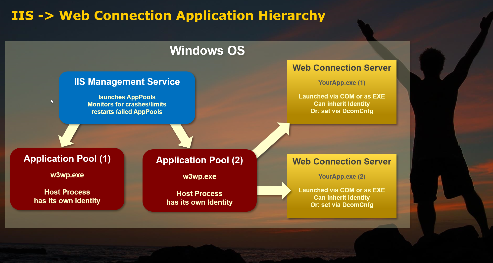

<small>**Figure 2** - IIS and Web Connection in the Context of Windows</small>

IIS is a Windows Web Server so everything is hosted within the context of the Windows OS. All the boxes you see in **Figure 2** are processes.

##### IIS Administration Service
The IIS Admin service is a top level service and somewhat disconnected system service that is responsible for launching Web Sites/Application Pools and monitoring them. When IIS starts or when you recycle IIS as a whole or an individual Application Pool you are interacting with the IIS Admin service. It's responsible for making sure that Web sites get started, keep running and monitors individual application pools for the various process limits you can configure in the Application Pool configuration. This service sits in the background of Windows and is internal to it - you generally don't configure or interact with it directly except when you use the Management Console, or **IISRESET** .

##### Application Pool
Application Pools are the **base process, an EXE** that one or more Web sites are hosted in. You can configure many application pools in IIS and you can add 1 or more Web sites to an application pool. Generally it's best to give mission critical applications their own application pool, while it's perfectly fine for many light use or static Web sites to be sharing a single Application Pool.

An application pool executes as an EXE: **w3wp.exe**. When you are running IIS and you have active clients you can see one or more w3wp.exe 

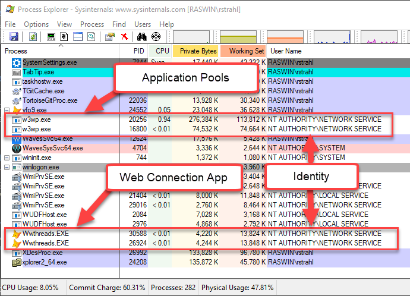

<small>**Figure 3** - Application Pools (w3wp.exe) and Web Connection EXE are separate processes with their own identity </small>

I think of an Application Pool as the Web application and I like to set the Identity of the Application Pool in the Application Pool settings as the only place where Identity is set. Instead, I use the default passthrough security for any processes that are launched from the application pool.

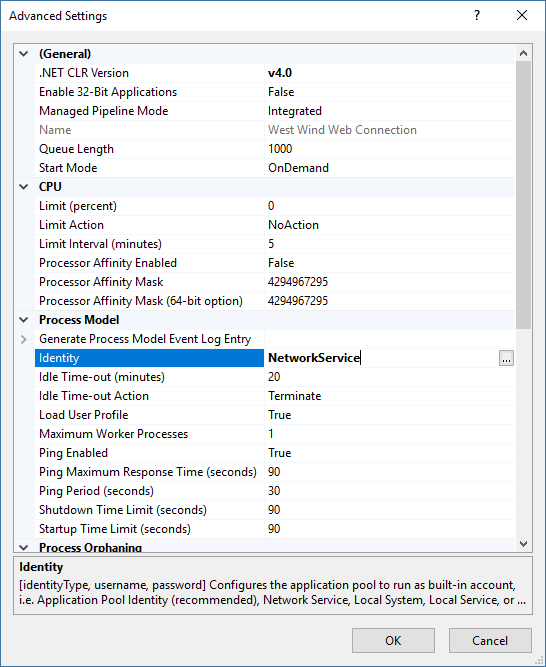

<small>**Figure 4** - You can set Application Pool Identity in the Advanced Settings for the Pool</small>

##### FoxPro Web Connection Server
Your FoxPro Web Connection Server runs as a seperate **out of process COM EXE** server or as a file based standalone FoxPro application. 

File based servers **always** are started either as the Interactive User if you explicitly start the server from Explorer, or it is started using the Application Pools Identity.

COM servers use either the Application Pool's Identity - which I **highly recommend** - or the Identity you explicitly assign in DCOMCnfg. I really want to dissuade you from setting Identity in DcomCnfg simply because it can get very confusing what's running what. The only time that makes sense if you really want your IIS process and your FoxPro COM server to use different accounts.

The idea scenario is that the default DCOM Identity configuration is use which is the **Launching User** using **DcomCnfg**:

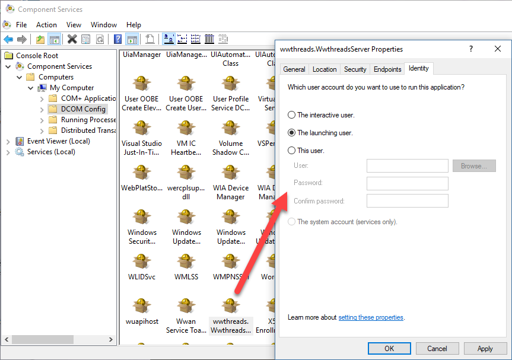

<small>**Figure 5** - DcomCnfg lets you set the identity of your FoxPro server. Don't do it unless you have a good reason</small>

Note that **Figure 5** shows the default so you never have to explicitly set the **Launching User**. Only set this setting if you are changing the Identity to something else.

> Make sure to use the 32 bit version of DcomCnfg:  
> `MMC comexp.msc /32`

##### When do you need DcomCnfg?
One big frustration with Web Connection is that it runs EXE server that **might** need configuration. If you are using the default setup for Web Connection which uses the SYSTEM account **no DCOM Configuration is required**. 

No DCOM Configuration is required for:

* SYSTEM
* Administrator accounts
* Interactive

**All other accounts** have to configure the DCOM **Access and Launch** and **Activation** settings to allow specific users to launch either your COM server specifically or COM servers generically on the machine.

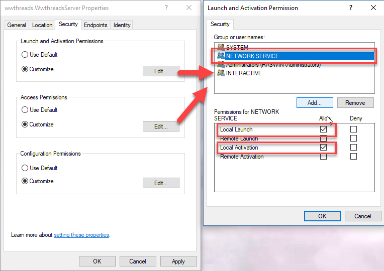

<small>**Figure 6** - Setting Launch and Access and Activate for a DCOM Server</small>

These permissions can either be set on the specific server as shown here, or at the **Local Machine** level in which case they are applied to launching all EXE servers.  In this example, I'm explicitly adding **NETWORK SERVICE** to the the permissions. Both **Launch and Access** (shown) and **Activation** have to be set.

> #### @icon-info-circle Network Service as a Production Account
> For production machines I often use **Network Service** because its a low rights, generic account that has to be explicitly given access everywhere, but it's generic and doesn't require a password nor requires configuration of a special user account which makes your configuration more portable.

> #### @icon-warning Beware of the ApplicationPoolIdentity
> IIS by default creates new accounts using **ApplicationPoolIdentity** which is a dynamic account that has no rights on the local machine at all. You can't even set permissions for it in the Windows ACL dialogs. This account is meant for static sites that don't touch the local machine in any way and they are **not appropriate for use of Web Connection**. You will not be able to launch a COM Server or even a file server from the Web server with it.

#### Identity and your Application
Once your security is configured your application runs under a specific account and that account is what has access to the disk and other system services. If your app runs under NETWORK SERVICE, so you won't be able to write `HKEY_LOCAL_MACHINE` in the registry for example or write a file into the `c:\Windows\System32` directory.

The goal is to allow access only in application specific locations so that if your application is compromised in any way at worst you can damage your own application and the user can't take over the entire machine. If you run as SYSTEM, it is possible for the attacker to potentially plant malware or other executing code that monitors your machine and sends data off to somewhere else.

It all boils down to this:

> Choose an account to run your application that has the rights that your application needs to run and nothing more

### File System Security
Related to the process identity is File System security. The file system is probably the most vulnerable aspect when it comes to attempted hack attempts. Hackers love to exploit holes in applications that allow any sort of file uploads that might allow them to plant an executable in the file system, and the somehow execute that file to compromise security or access your data.

The best avenue to thwart that sort of scenario is to minimize file permissions as much as possible.

#### Choose a limited Application Account
A lot of this was discussed in the Application Pool security section where I discussed using a low rights account and then giving it just the rights needed to run the application. Once you have a low rights account start with minimal permissions needed and very selectively give WRITE permissions.

##### Web Folders
* Read/Execute Permissions in the Web Folder
* *Read/Write for `web.config` or `wc.ini` in Web Folder   
  to persist Admin page configuration settings (optional)*

##### Application Folder  
* Read/Execute in the Application/EXE folder
* Read/Write access in Data Folders
* Better: Don't use local data, but a SQL Backend for Data Access

#### Isolate your Data
In addition to system file access you also have to worry about data breaches. If you're using local or network FoxPro data you need to worry about those data locations.

##### Don't allow direct access from the Internet
This seems pretty obvious but any data you access from your application should only be accessible internally with no access from the Internet. Don't put data into a Web accessible path inside of your Web site. Always put data files into a completely separate non-Web accessible folder hierarchy.

Web Connection by default uses this structure:

```text
Project Root
--- Data                 Optional Data Folder
--- Deploy               Application Binaries
--- Web                  Mapped Web Folder
```

This is just a suggestion, but **whatever you do, never put data files (or anything else that is sensitive) into the Web folder**. It's acceptable to put data into the `Deploy` folder as a subfolder. Do put your data files into a self-contained folder so it's easy to move the data. 

And while you're at: For God's sake **don't hardcode paths in your application**. Try to always use Relative Paths, and if possible use variables for path names that can be read from a configuration file. If there's ever a problem being able to move the data quickly is key and having hard coded paths makes that very difficult. Configured paths from a configuration file can be changed without making code changes.

Ideally for security data should not be stored locally on the server, but rather sit on another machine that is not otherwise Internet accessible. The other machine should be on the internal network only or be accessible only via VPN. Make it so only your application account has access.

##### Use a SQL Backend on a Separate Server
An even better solution is to remove physical data entirely from the equation and instead storing your data inside of a SQL backend of some sort with the only way to access the data via username/password in the connection string that's encrypted.

As with data files, you want to make sure that the SQL backend is not exposed directly to the Internet. SQL Server by default doesn't allow remote access, but you can lock it down to specify which IP addresses or subnets have access. Likewise databases like MongoDb let you cut off internet access completely. Either way make sure that you use complex username and password sequences that are hard to break and store passwords in a safe place - encrypted if possible.

## Protecting your Data
The next thing you'll want to do is ensure that your server is not leaking data and that the data you do send to others is secure and can't be spied upon.


### Certificates: Protected Traffic on the Wire
The data you send over the wire may be sensitive or confidential. Or it's as simple as the fact that you log into a Web site and you send a username and password and that data has to be secure.

Web Server Certificates are meant to address this issue by encrypting all content that is transmitted over the Web connection. Both data you send and the data that comes back is encrypted using strong public key cryptography which makes it nearly impossible to spy on traffic as it travels over the wire.

Intercepting HTTP traffic is easier than you might think. Using little more than a network analyzer it's possible to siphon packets off the network and piece together requests if they are not encrypted. Worse there are hardware devices out there that can pose as a WiFi access point that capture network packets and then pass them on to another router as if nothing was wrong. Encryption of content over HTTPS prevents most of the attack vectors for this type of attack.

TLS (Transport Layer Security) addresses these issues by encrypting your content in such a way that your browser and the server are the only ones that can decrypt the content that travels over the wire making it very difficult for anybody listening in on the conversation 'en route' to get useful data out of the network packets.

#### TLS is for Security only not for Validation
One important thing to understand about TLS encryption and certificates is that the purpose of certificates is to encrypt content on the wire. 

There are a couple of different 'grades' of certificates:

* Standard Certificates (Instance Domain Validated)
* Extended Validation (EV) Certificates

Contrary to what the big SSL Service companies like Verisign, Commodo, Digicert etc. want you to believe, certificates are not meant to serve the purpose of validation for a specific site. But 'Extended Validation' certificates purport to do this by requiring the registrant to go through an extra validation process that is not required for standard Certificates. Standard Certificates are validated simply by checking that the DNS for the domain is valid and matches the signature of the certificate request.

EV Certificates are a lot more expensive, especially now that Standard certificates are effectively free from LetsEncrypt (more on that in a minute). There's no difference between a standard certificate from LetsEncrypt or Verisign or Commodo - they all use the same level of encryption and the same level of DNS validation for example. EV certs do offer the green company name in the address bar, but if you check amongst the most popular sites on the Web you'll find that very few even very big companies bother to use these EV certificates. It's really just wasted money.

#### Wildcard Domains
If you need to secure an entire domain and all of its sub sites - ie. `support.west-wind.com`, `markdownmonster.west-wind.com`, `store.west-wind.com`, `west-wind.com` - you can use a **Wildcard Certificate**. Wildcard certificates let you bind a single certificate to any sub-domain and they are nice if you have a ton of subdomains, and absolutely essential if you run a multi-tenant Web site that uses subdomains. 

For example, Markus Egger and I run [kavadocs.com](https://kavadocs.com) which lets users create subdomains for their own documentation sites: `websurge.kavadocs.com`, `westwind-utilities.west-wind.com` and so on are all bound to the single wildcard domain and managed through a single wildcard DNS entry that maps back to an Azure Web site. The application can then read the `SERVER_NAME` Server Variable to determine the target domain and handle requests for that particular tenant.

> LetsEncrypt has been offering free certificates for a few years now and I've been running on those for the last 2 years. LetsEncrypt also started offering free wildcard domain certificates earlier this year so that makes it even easier to handle multi-domain web sites more easily. 

#### HTTPS is no longer an Option
If you plan on running a commercial Web site of any sort, plan on using HTTPS for the site. Even if you think there's nothing sensitive about your site of cat pictures, there are good reason to always use HTTPS for your requests.

* It's easy: No changes required on your Web site
* It's more secure (Doh!)
* It's free 
* **Non secure sites are ranked lower on Search Engines**

##### No Web Site Changes required
Switching a site to run from plain HTTP to HTTPS doesn't require any changes. HTTPS is simply a protocol change which means the only difference is that the URL changes from `http://mysite.com` to `https://mysite.com`. Assuming your code and links are not explicitly hardcoding URLs - which it definitely should not - you shouldn't need to make any changes. You can easily switch between HTTP and HTTPS and behavior should otherwise be the same.

##### TLS Certificates are now Free and Easy thanks to LetsEncrypt
A few years ago, Mozilla and consortium of industry players got together and created a free certificate authority called **LetsEncrypt**. LetsEncrypt provides domain specific TLS certificates **for free** using an open organization rather than a commercial entity to provide this service. What this means is that the service is totally free, no strings attached and it's designed to stay that way as it is not a commercial venture but rather an not-for-profit consortium of organizations that promote security on the Web.

##### LetsEncrypt makes Certificates Easy To Manage
In the past both price and certificate requests and installation was a pain, but LetsEncrypt also helps with the process. Not only are LetsEncrypt Certificates free, they are also very easy to install, revoke and renew. LetsEncrypt provides a set of public APIs that are used to make certificate requests and this **ACME protocol** framework provides a standards set of tools to manage the entire certificate creation, validation, revokation and renewal process.

There are tools for almost any platform that makes it easy to integrate with LetsEncrypt. On Windows there's an open source tool called [Win-Acme](https://github.com/PKISharp/win-acme) (formerly called LetsEncrypt-Win-Simple) which makes it drop dead simple to create a certificate **and install it into IIS**. It's so easy you can do it literally in less than 5 minutes.

Let's walk through it:

* Download the latest Win-Acme release from:  
https://github.com/PKISharp/win-acme/releases

* Unzip the Zip file into a folder of your choice
* Open an Administrative Powershell or Command Prompt
* `cd` into the install folder
* run `.\letsencrypt`

In the following example I'm creating a new certificate to one of my existing sites `samples.west-wind.com`. Before you do this make sure your DNS is set up and your site is reachable from the Internet using its full domain name.

Once you do this here's what running LetsEncrypt looks like:

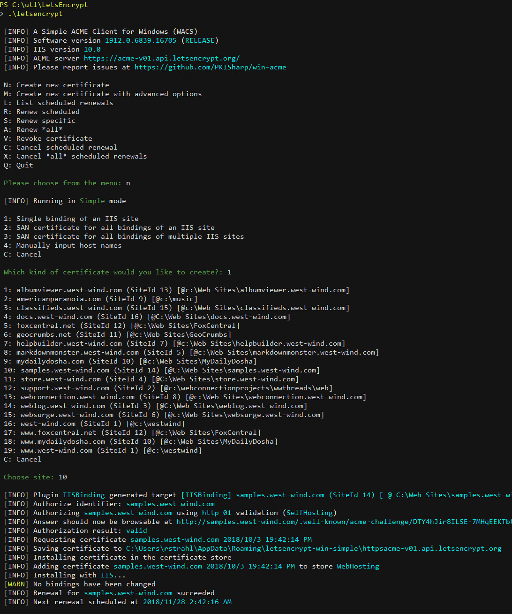

<small>**Figure 7** - Executing Win-Acme LetsEncrypt from the Commandline </small>

In this run I create a single site certificate so I just Create **New Certificate**, then choose **Single Binding**, then pick my site from the list (10 in this case). And that's it. 

LetsEncrypt then goes out and uses the ACME protocol to make a new certificate request which involves creating the request and putting some API related data into a `.well-known` folder that LetsEncrypt checks to verify the domain exists and matches the machine that the certificate request originates from. LetsEncrypt calls back and verifies the information and if that's good issues a new certificate that is passed back to the client. The client then takes the completed certificate, imports it into IIS and creates the appropriate certificate mapping on your selected Web site.

Et voila! In all of 3-5 minutes and no manual interaction at all, you now have a new certificate on the site:

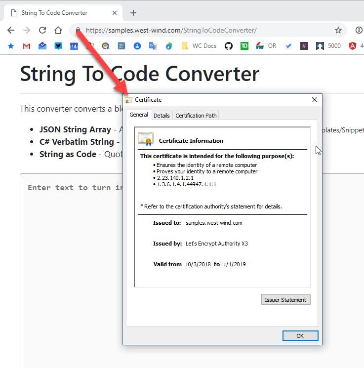

<small>**Figure 8** - A valid LetsEncrypt TLS Certificate on the site</small>


and in IIS:

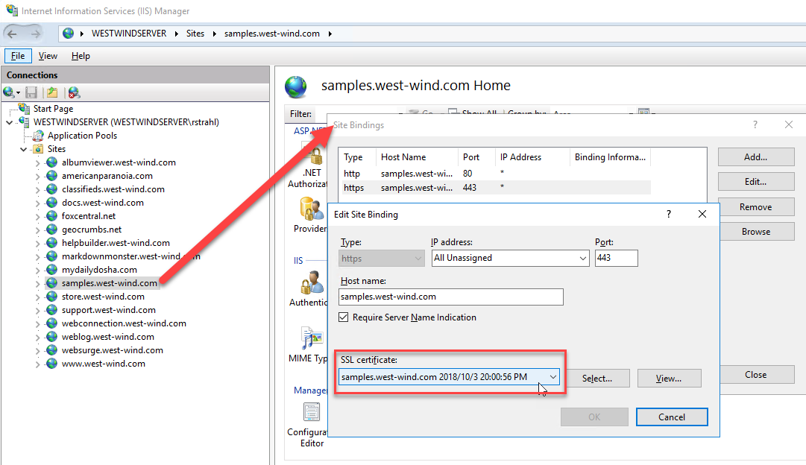

<small>**Figure 9** - LetsEncrypt automatically bind the certificate into IIS</small>

LetsEncrypt also installs a scheduled task that once a day checks for certificates that are within a few days of expiring and automatically renews them. LetsEncrypt is smart enough to not renew or replace certificates that are already installed unless you use a `--forcerenewal` command line switch. 

> With certificates being **free** and **ridiculously easy to install** there's no reason not to install SSL certificates

##### Search Engines optimize Secure Sites
Google and Bing a couple of years ago started optimizing search rankings based on whether sites are secure. Non-secure sites are ranked down over secure sites with similar content.

This alone ought to be enough reason for any commercial site to use HTTPS for all requests.

#### Forcing a Site to use SSL
When you type a URL into a browser by default the URL is an http url. Recently browsers started to check for https first, then try http if that failed however that doesn't seem to be 100% reliable. You'll want to make sure that your site always returns HTTPS content.

The easiest way to do that is by using a **Url Rewrite Rule**. IIS has an optional tool called **UrlRewrite** that can be installed that allows you to apply a set of rules to rewrite any URL that comes into your site. Unfortunately UrlRewrite is not a native IIS component, so you have to install it first. Easiest is to [install it with Chocolatey](https://chocolatey.org/packages/UrlRewrite):

```ps
choco install UrlRewrite
```

Alternately you can install it with the IIS Platform Installer from this download link:

* [Download UrlRewrite](https://www.iis.net/downloads/microsoft/url-rewrite)

Once installed, UrlRewrite Rules can either be created in the IIS Admin UI, or you can directly add rules into the Web site's `web.config` file.

```xml
<configuration>
<system.webServer>
<rewrite>
  <rules>
    <rule name="Redirect to HTTPS" stopProcessing="true">
      <match url="(.*)" />
      <conditions>
        <add input="{HTTPS}" pattern="^OFF$" />
      </conditions>
      <action type="Redirect" url="https://{HTTP_HOST}/{R:1}" redirectType="SeeOther" />
    </rule>
  </rules>
</rewrite>
</system.webServer>
</configuration>
```

This rule basically checks every URL that is **not** running `https://` by checking the `HTTPS` header for a value of `OFF` (ie. it's not HTTPS). If it is off the URL is rewritten with the new protocol prepended to the host and the captured site relative path.

Once this rule is active any request to `http://` is automatically re-routed to `https://`.

Note that you may also want to install a local, self-signed certificate in IIS for your local development so that your live and local dev environment both use HTTPS.

#### Just Do It
If you've been holding off using HTTPS, **the time is now!** Using LetsEncrypt makes the process of creating a new certificate and getting it into IIS ridiculously easy and best of all it's **free**.

5 minutes and no money down - what could be easier? You have everything to gain and nothing to lose.

### File System Security
We already discussed Identity and how it affects file access, but let's turn this around and look at this from the application perspective. Each Web application is made up of a folder hierarchy(ies) which the application needs to access.

> The golden standard for file system security is use rights that you and nothing more

In file system terms this usually means you need to make sure your Web application can access:

* Your Application Folder (read/execute)
* Your Data Folder if using FoxPro data (read/write)
* Your Web Folder (read/execute)

#### Use a non-Admin Account
If you want to be secure everything starts by using a non Admin/non SYSTEM account that by default has **no rights anywhere on the machine**. Essentially, with an account like that you are **white listing** the exact folders that are allowed access and keep everything else off limits. If you build a single self contained application this should be easy to do. It gets more complicated if you have an application that needs to interact with other components or applications that also live on the same system. You should try to minimize these but even if that's the case you would still selectively enable rights as needed.

#### Minimize User Accounts
Remove or disable any user accounts on a server that are not used. Any user account is a potential attack vector. Windows won't create extra accounts but if you're using a shared server that's probably not an option. Even on shared machines make sure you know what each account is for and minimize what's there.

For Web Servers I recommend you don't expose domain accounts unless you need them to log into admin functions of the application. Using local accounts and duplicating them is a much safer choice to avoid potential corruption. THere should be very little need to use Windows Security on a Web server with the exception of the West Wind Web Connection Administration features. If you really want to you can even switch that to ASP.NET Forms Authentication with auth info stored inside of `web.config`.

#### NTFS File/Directory Permissions
IIS recognizes Windows ACL permissions on files and directories and again the Identity of your application is crucial here. There are two accounts that need to have rights to access a Web Site:

* The Application Pool Identity has to have Read/Execute rights
* The IUSR_ Account is required for Anonymous users to access the Web site

If you have any specific users you want to lock out you can remove or explicitly block the IUSR_ account. Web Connection does this by default to the /Admin folder which requires logging in order to be accessed because IUSR_ has been removed.

#### Beware of File Uploads
One of the scariest things you can do in a Web application is uploading files to a server. File uploads essentially allow a third party to bring content to your server, and you have to be **extremely** careful with what you do with file uploads.


##### The Threat of Remote Execution
The biggest concern is that somehow an executable file of some sort is uploaded, stored in a Web Folder and then executed remotely. Think for a minute that somehow a black hat is allowed to upload an ASPX page or a Web Connection script. If that is possible in any way shape or form the attacker basically has card blanche to execute code on your server, under the Idenity your application is running which is likely to be at least somewhat elevated. At the very least the attacker will access to your data, at worst if running as SYSTEM or Admin he can hack into your system and install additional malware that does much worse like install Ransomware, or install Malware that basically monitors whatever travels over the network.

##### Limit what can be Uploaded
The first defense with file uploads is to limit what can be uploaded. There should be no reason to ever allow binary or script files to be uploaded. Uploads should always filter both on the client and the server for the specific file types expected. 

If you are expecting images, restrict to images, if you need a PDF allow only PDFs. If you need multiple files ask for a Zip file and **always, always check extensions** both on the client and server.


On the client use the `accept` attribute:

```html
<input type="file" id="upload" name="upload"
       multiple accept="image/*" />
```

On the Web Connection server you can explicitly check the file names and extract the extensions to check:

```foxpro
*** Files must use GetMultipartFile to retreive the file name as well
loFiles = Request.GetMultiPartFiles("Upload")

FOR EACH loFile IN loFiles
	lcExt = LOWER(JUSTEXT(lcFileName))
	IF !INLIST(lcExt,"jpg","png","jpeg","gif")
	   THIS.StandardPage("Upload Error","Only image files are allowed for upload.")
	   RETURN
	ENDIF
	IF LEN(loFile.Content) > 1500000
	   THIS.StandardPage("File upload refused",;
	                     "Files over 1.5meg are not allowed for this sample...<br/>"+;
	                     "File: " + loFile.FileName)
	   RETURN
	ENDIF
	
	...
ENDFOR	
```

Never allow uploads to upload 'just anything' - always limit the supported file types to specific content types. The most common things that are uploaded are images, pdfs, and Zip files. Zip files are relatively safe since they can't be executed as is.

##### Never Store Executable or Script Code in Web Accessible Folders
If you allow people to upload executable code (you never should - but if you for some crazy reason do) don't allow that content to be accessible from anywhere in your Web site.

##### Require a Login for Uploads
Any site that allows random file uploads should always require logins so that at the very least the user had to register at some point and there's at least a minimal audit trail. Just having a login will dissuade a huge number of generic attacks because without having a compromised account there's no way to even try to find random POST and Upload links on a site by Web site scanners. Authentication is a quick and easy way to remove a bunch of malicious activity.

This holds true for most POST/PUT operations in general. Read only content is rarely a problem for hacking problems, but any operation that involves **data writing** has potential to attract bad operators.

Most applications easily can justify an account requirement for data updates.

### System Security Summary
So far I've primarily talked about System Security that's not very specific to Web Connection. System security is vitally important for setting up and configuring your system and getting it ready to host an application.

Windows and IIS have gotten pretty good over the years of reducing the attack service for hacking drastically by minimizing what features are enabled by default and forcing Administrators to explicitly enable what they need. The Web Connection configuration tools  help with this considerably in ensuring that your application is reasonably well configured right out of the gate, but you should still review the base settings. 

The most important thing to always consider is the application Identity discussed earlier and applying that identity selectively. Next we'll look at application security which arguably is even more important and more relevant to developers.

## Protecting your Application
System security is the underlying security issue that you need to avoid, but application security is usually the entry point for potential hacking attempts. Before system security can be compromised, 99% of the time the application has to be compromised first to even allow access to system security features.

There are a number of different aspects to this. At a high level there's authentication and access level secuity of an application that's responsible for making sure only the appropriate user can see the data that he or she has access to. Failing on this end can cause data breaches where data can be accessed in unauthorized ways.

The other issue is potential holes in the application's security that might allow the application itself to be highjacked. Maybe it's possible to somehow execute code that can then jump into the system security issues that I discussed in the last section. Remote execution hacks are among the most critical and something that any application that uses dynamic code or scripts potentially has to worry about.

Finally there's also JavaScript exploits, mostly in the form of Cross Site Scripting (XSS) attacks that can compromise user data as they are using the application. XSS attacks are based on malicious JavaScript code that has made its way into an application and then can execute malicious JavaScript code that can send off sensitive data to another server.

### Web Authentication in Web Connection
Authentication is the process of logging users in and mapping them to a user account.  Web Connection supports authentication in two ways. 

* **Windows or Basic Authenication against Windows Accounts**  
This is a quick and dirty way for authentication where you don't have to set anything up and it just works. This uses Windows accounts, but it's really appropriate only for internal network applications or for securing say an Admin area of a Web site. It's not really appropriate for general public authentication because it requires Windows accounts that have to be configured which is not very practical.

* **User Security Authentication**   
This mechanism is implemented using a FoxPro class and is based around a single cookie and a matching session record for each authenticated user. This mechanism uses a class with a few simple authentication methods and stores user data in a FoxPro table. The class is meant to be overridden by applications to add custom features or store data in some other storage like SQL Server.

Authentication is managed by the wwProcess class which has a handful of methods to authenticate users and customize the login process.

The base features of mechanisms can be used interchangeably by specifying the mechanism in the Process class. Here are some of the things you can override in your Process class 

```foxpro
*** Basic UserSecurity mode: Basic or UserSecurity
cAuthenticationMode = "UserSecurity"
```

> It should be noted that **Basic** will also work with Windows Authentication if enabled on the Web server - it basically looks at IIS login information rather than the Session info UserSecurity uses.

> #### @icon-info-circle Don't use Basic for application level Security
> Basic and Windows Auth is useful for internal apps or little one of applications that you build for yourself, but for public facing sites managing users with Windows authentication is terrible. You also have very little control over the login process and you get an ugly pop up window that is not application styled. For the rest of this section we'll talk about **UserSecurity Authentication  only**.


#### Forcing a LogIn
Authentication is meant to protect access to a Web Connection request or part thereof. If you want to make sure a user is authenticated, you can use the `Authenticate()` method to check whether the user is authenticated and if not pop up an authentication form:

```foxpro
FUNCTION MyProcessMethod()

*** Checks if logged in
*** If not a Auth dialog displays
IF !THIS.Authenticate("ANY")
   RETURN   && Just exit processing
ENDIF

THIS.StandardPage("Hello World",;
      "You're logged in as " +	this.cAuthenticatedUser )
```

If a user hits this request an auth dialog pops up automatically. For Basic/Windows auth a system dialog pops up. For UserSecurity an HTML form pops up.

Here's the default UserSecurity login form:

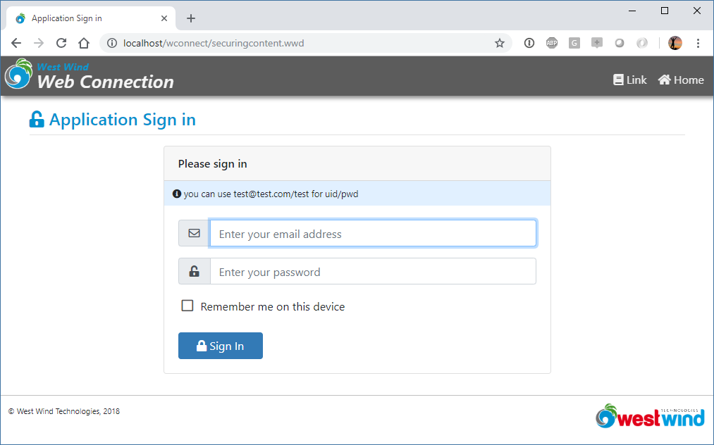

<small>**Figure 10** - A UserSecurity Authentication request</small>

By default the login form is driven by a template in `~/Views/_login.wcs` which you can customize as you see fit. The template contains a link to the main `_layout.wcs` page which provides the page Chrome`.

#### Very basic out of Box UI Features
The thing to understand about the built in authentication UI features is that they are very basic. It allows you to force a login, but there's no built-in mechanism for creating a new account, recovering a password or anything else related to account management. The form in **Figure 10** basically just provides a login against a FoxPro table (or your own subclass which can do whatever it needs). I'll discuss of how to build that part of the functionality a little later on.


### User Security Authentication
The user security class provides a base class called `wwUserSecurity` which provides simple user authentication and basic CRUD operations for adding, editing, deleting and looking up of users.

The most important method is the `wwUserSecurity.Authenticate()` method which is used to actually validate a username and password by looking it up in the `UserSecurity.dbf` table by default. The method checks for active status, account expiration and optionally manages looking up an encrypted password.

User Security works by using a Cookie and Web Connection's Session object to track a user, and it use the wwProcess class to expose the relevant user information as properties. You can use properties like `Process.lIsAuthenticated` to check whether the user is authenticated or `Process.cAuthenticatedUser` or `Process.cAuthenticatedName` for the user id and user name respectively. You can also access `Process.oUserSecurity.oUser` to get access to all of the user data that's stored in the user table if authenticated.


UserSecurity works by using a Cookie and Session State to track the user. This means User Security requires that you turn on Session usage in `OnProcessInit()`:

```foxpro
FUNCTION OnProcessInit
...
InitSession("myApp")
...
ENDFUNC
```

#### Extending UserSecurity
The User Security is very simple and very generic and is meant to be used as a base class that you subclass from. At the very least I recommend you create a subclass for every application and change the table name to something specific to your application.

```foxpro
DEFINE CLASS TT_Users AS wwUserSecurity

calias = "tt_users"
cfilename = "tt_users"

ENDDEFINE
```

This now uses the users table as `tt_users.dbf` instead of `UserSecurity.dbf`. Why do this? It'll make it very clear what's stored in the user table, but it also avoids conflicts with other applications or even the Web Connection sample which also uses a UserSecurity table of its own.

The most common thing you'll do in a wwUserSecurity subclass is to override the Authenticate method. If you need to authenticate against a table in your application, or maybe some other object service like ActiveDirectory, you can do that by simply overriding the `Authenticate()` method. It takes a username and password and you can customize your 'business logic' here to provide custom authentication.

```foxpro
DEFINE CLASS TT_Users AS wwUserSecurity

FUNCTION Authenticate(lcUsername, lcPassword)

* Custom Lookup against SQL Server
llResult = SomeOtherLookupRoutine()

RETURN llResult
ENDFUNC

ENDDEFINE
```

You can of course also override any of the other methods in the class, so it's possible to for example change wwUserSecurity to use SQL Server or MongoDb as a data store.

#### Overriding the Web Connection Authentication Processing
Above I've described overriding business logic which is the core of data access. In addition to that you can also override the Web application flow. You can:


##### Override the Authentication Rendering 
You can use the `OnShowAuthenticationForm()` method to provide custom rendering. This might be as simple as pointing at a different template, or completely writing code to show a the Login UI.

In your wwProcess subclass:

```foxpro
FUNCTION OnShowAuthenticationForm(lcUserName, lcErrorMsg)
Response.ExpandScript("~\views\MyGreatlogin.wcs")
```

##### Override the User Authorization Process 
The most common thing people will want to do is to override the authentication itself. As mentioned you can do this also by overriding `wwUserSecurity.Authenticate()` but you can also do it in the process class.

This is the default implementation and realistically you can replace this code and return `.t.` or `.f.` with our own.

For example, on my MessageBoard I use a separate user table to login users so I completely replace the `Process.OnAuthenticateUser()` method:


```foxpro
FUNCTION OnAuthenticateUser(lcEmail, lcPassword, lcErrorMsg)

*** THIS IS THE DEFAULT IMPLEMENTATION 
*** To override behavior override this method
IF EMPTY(lcEmail)
   lcEmail = ""
ENDIF 
IF EMPTY(lcPassword)
   lcPassword = ""
ENDIF

loUserBus = CREATEOBJECT("wwt_user")

*** Default implementation is not case sensitive
IF !loUserBus.AuthenticateAndLoad(LOWER(lcEmail),lcPassword)
	*** Set lcErrorMsg to pass back via REF parm
	lcErrorMsg = loUserBus.cErrorMsg
	RETURN .F.
ENDIF	

*** Assign the user
this.cAuthenticatedUser = lcEmail && email
this.cAuthenticatedName = TRIM(loUserBus.oData.Name)

*** Add a custom sessionvar we can pick up on each request
Session.SetSessionVar("_authenticatedUserId",loUserBus.oData.CookieId)
Session.SetSessionVar("_authenticatedName",TRIM(loUserBus.oData.Name))
Session.SetSessionVar("_authenticatedAdmin",IIF(loUserBus.oData.Admin != 0,"True",""))

RETURN .T.
ENDFUNC
```

In this case I'm setting some custom Session vars that pull relevant information that my UI needs out of the session table. This is quicker than a user look up each time and these values are simply 'cached' once a user is logged in.

##### Override behavior when User is Validated
You may also want to know whether a user is authenticated or not and if he is perform some additional actions. For example, in many applications it's useful to set some additional easily accessible properties that provide more info on the user such as the user name, an email address that are not stored by default.

In that same application I set a few variables on the Process class ensure I can easily embed information into a login form.

```foxpro
FUNCTION OnAuthenticated()

LOCAL loUser as wwt_user, loData
loUser = CREATEOBJECT("wwt_user")
IF loUser.LoadFromEmail(this.cAuthenticatedUser)
   this.oUser = loUser
   loData = loUser.oData
   loData.LastOn = DATETIME()
   this.oUser.Save()   

   this.cAuthenticatedName = TRIM(loData.Name)
   this.cAuthenticatedUserId = TRIM(loData.CookieId)
   this.lAuthenticatedAdmin = IIF(loData.Admin # 0,.t.,.f.)
ELSE
	*** get our custom properties from Session
	this.cAuthenticatedName = Session.GetSessionVar("_authenticatedName")
	this.cAuthenticatedUserId = Session.GetSessionVar("_authenticatedUserId")
	this.lAuthenticatedAdmin = !EMPTY(Session.GetSessionVar("_authenticatedAdmin"))
ENDIF

ENDFUNC
```

##### Overriding Process.Authenticate()
The above methods all are low level functions that are called by the `Authenticate()` method which acts as a coordinator for various sub-behaviors. If you want to do something really custom for your authentication you can completely override the Authenticate() method altogether. 

All of these functions have default implementations and if you do subclass them I recommend you copy the existing method and modify it to fit your needs. You'll be able to see how the base features work and what values they expect as input and what to send as results.

### A custom User Security Manage

> #### To be added later

### Cookies and Sessions
Most applications need to track something about the user after the user has logged in. At minimum you need to track the user's user ID so you can identify the user on the next request. The typical way this is done is by using HTTP Cookies which is a small bit of text that is stored in the browser's internal state storage and that is sent to the server with every request while the cookie is not expired.

#### Cookie Usage
Cookies should be used very sparingly and in general you should not store data in cookies, but rather identifiers that link back to content that is identifiable on the server. Cookies are often used in conjunction with server side Session State that provides for the actual 'data' stored that is related to the user cookie.

The idea is that cookies are references to data that the server needs in order to identify a user and provide commond default functionality. For example, you need to track a logged in user, so that you can display the account information for that specific user after the user has logged in. If it weren't for cookies that identifying id would have to be passed by every request explicitly on the URL query string or form buffer. So to make this easier browsers provide a Cookie interface.

Cookies are **set by the server** and **persisted by the client** and **sent to the server** on any subsequent server request.

You can look at the cookies you are using in any of the browser DevTools:

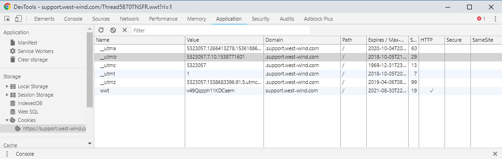

Notice that most of the values stored there are single value identifiers. Also note that there can be many cookies and in the figure above most of the cookies are actually 3rd party cookies (from Google Analytics and AdWords specifically)

Cookies are tied to a specific domain and have an expiration date if specified. By default **Cookies persist for the duration of the browser session**. Shut down the session kills the Cookie. You can explicitly set an expiration date though and the cookie then persists until that date in this browser.

You can create cookies in Web Connection with the [Response.AddCookie()](https://webconnection.west-wind.com/docs/_1o80yq3ey.htm) function:

```foxpro
Response.AddCookie("wwmsgbrd",loUser.Id,"/",Date() + 5,.t.,.t.)
```

You pass:
* A cookie name
* A string value
* A path: this defaults to the root of the site  
*(you should never use a different value for this!)*
* An optional expiration date (or .F.)
* HttpOnly Cookie
* Secure HTTPS based Cookie only


The `llHttpOnly` flag determines that the cookie cannot be accessed from code, meaning it's not JavaScript hackable. It's a good idea to always use this featured *unless you explicitly need the cookie to be accessed in JavaScript* which should be very rare. 

The `llHttpsOnly` makes it so that cookies are not set or sent when requests are not running over HTTP which prevents potential hacking of cookies in man-in-the-middle attacks. If you run your site only using HTTPS it's a good idea to enable this flag.

> #### @icon-info-circle Keep Cookie Expiration Short
> Although it's tempting to never expire cookies when persisting them, it's generally not a good idea to use long expiration times. Instead keep the expiration times to a few days max and allow for refreshing the cookie when a user comes back. Web Connection Session state automatically does rolling renewals as you access a site for persisted cookies.

#### Session Storage - Server Side State
Related to Cookies are Sessions, which store the active user's state on the server in a table. Cookies are meant to just hold identifiers, and a common use case for cookies is a `Session Id` that maps the cookie to a Session id on the server.

##### Web Connection's Session object
Web Connection's [wwSession Class](https://webconnection.west-wind.com/docs/_s8413ze4y.htm) uses a single cookie to link a Session table to a client side cookie. So rather than having a bunch of cookies on the client that hold information like Username, last on, and other info, that data can be stored on the server and read by the server side application. This is good because it doesn't make any of this potentially sensitive information available in the browser in a persistent fashion where it might be compromised. Instead Sessions store the key value pairs in a table on the server.

Sessions are easy to use but they do have to be enabled explicitly. To do that you can calle `Process.InitSession()` - typically in `Process::OnProcessInit()` - to enable them:

```foxpro
FUNCTION OnProcessInit

*** all parms are optional
*** wwDemo Cookie, 30 minute timeout, 
*** don't persist cookie across browser sessions
THIS.InitSession("wwDemo",1800,.F.)
...
RETURN
```

> If you're using Authentication using `wwUserSecurity` as described earlier SessionState is automatically enabled in its default mode. I still recommend you explicitly configure Sessions as shown above for more control over how Sessions are configured.

Once sessions have been set up you can set Session variable using `Session.SetSessionVar()` and `Session.GetSessionVar()`:

```foxpro
FUNCTION YourProcessMethod

lcSessionVar = Session.GetSessionVar("MyVar")
IF EMPTY(lcSessionVar)
   *** Not set
   Session.SetSessionVar("MyVar","Hello from a session. Created at: " + TIME())
   lcSessionVar = Session.GetSessionVar("MyVar")
ENDIF

THIS.StandardPage("Session Demo","Session value: " + lcSessionVar)
RETURN
```

##### What to use Session for
Common Application related things to store in SessionStorage are:

* User name
* Email address (for Gravatar links for example)
* Last access date for features
* Simple preferences 
* **anything that needs to persist and doesn't fit a typical business object**

The advantage of Session storage is that it's often quicker to retrieve Session data than to pull that same data out of one or more business objects. Sessions values are good for values that are user specific but don't fit into user specific business objects - usually related around operational values that have to do with preferences and site settings.

Although you can use Sessions to store this there's no requirement for this. You might also directly access a user table and user record that holds similar information in a more strongly typed format of a class with properties. But that's up to you.


#### Don't make Cookie and Session Timeouts too long
It's important to make sure Sessions and Cookies don't persist forever. It's good to allow keeping them alive with an explicit **Remember Me** option, but make sure that you don't expire the cookies too far in the future. While the cookie or session are valid it's possible to just get into a site for example, and you don't want unauthorized access from accidental physical access or worse a physically compromised machine. 

If you need to perist cookies/sessions keep it to a few days max and instead rely on rolling updates. Rolling updates refresh the cookie after each use and persist the cookie out for another timeout period. `wwSession` does this automatically, so there never should be a reason to have really long sessions timeouts. For 'persistent' sessions using a few days max is probably a good call. Session uses 5 days in advance to remember you. If you use the site that infrequently then it's probably Ok to force a new login. But if you are frequent user that accesses the site every day you probably appreciate not having to login each time.

## Locking Down Web Connection

There are two areas of concern when it comes to locking down Web Connection:

* Your Application
* Web Connection Administration Tools

### Application
A Web Connection application is your's to manage and the `wwUserSecurity` and `wwProcess` security I discussed in the last section is what's needed to lock down your application. 

You can block requests to individual requests using `Authenticate()`, or if you want to be more granular you can look at the `Process.oUserSecurity` object for more specific rules to display or hide fields and other features.

How any of this works, depends entirely on the requirements of the application.

### Web Connection Admin Security
For the administration end of things there are two things that need to be locked down:

* The `admin/Admin.aspx` Page
* Web Connection .NET or ISAPI Handler Administration

These two pages contain very sensitive operations that let you change the application's system behavior that can take down your site.

For this reason it's very important to make sure these pages are not accessible.

Start by removing `IUSR_` rights from the `admin` folder in your Web Connection site. This disallows anonymous access and essentially forces a login to any physical pages in that folder.

Next make sure that the `AdminAccount` key in `web.config` or `wc.ini` **is not empty**. This account is used to protect the Handler admin page and if it is not set the page is openly accessible. By default this value is set to `ANY` which means any authenticated user can access the page, but it's better to apply a specific account or comma delimited accounts that can access the page.

## Script Attacks
One common attack vector for hackers is to try to hack scripts and dynamic code generation code by 'injecting' malicious code into user input. Any site that takes user input has to be very aware of how that input might be displayed later. 

Always be wary of data that is entered and then displayed back to users. There are a number of different attacks but the most popular even to this day are:

* Cross Site Scripting (XSS) Attacks
* Sql Injection Attacks


### Cross Site Script (XSS) Attacks
Cross site scripting gets its name from the idea that almost any code that manages to get injected into a page, ends up sending data to another site, thereby stealing potentially sensitive data.

#### What is XSS?
XSS works through user input and injecting script code into the input in hopes that the site operator doesn't properly sanitize their input. The problem with input is that if you simply echo back raw HTML tags as is without Sanitizing them these HTML tags will render as - well HTML. The problem is that HTML also has support for script execution in a number of ways and if a black hat can plant a bit of script code into user input that is then displayed to all users who get to see his user input - somebody just won at XSS Bingo!

So say, you are running a message board like I do and you take raw user input. Lets say I allow users to type plain text or markdown. Now our Fred Hacker comes along and types this into my simple `<textara>`


```markdown
Hey, 

Cool Site.

<script>alert('gotcha!')</script> 

<script src="https://gotcha.com/evilMindedWizard.js"></script>

Like what you've done here. Come check out 
<a href="javascript: alert('gotcha')>my site</a>

<div style="padding: 20px;opacity: 0" onmouseover="alert('mouse gotcha');">
</div>
```

If I capture that content with `Request.Form()` then write it to a database, then later display it to my users **as is** like this:

```html
<%= poMessage.Message %>
```

I'll be in for a rude awakening. Now everytime the page with this message loads for other users browsing the this site they see alert boxes popping up. And of course that's pretty benign - more likely a large block of code would be used to high jack browser cookies and potentially other sensitive content on the page and send it to another site.

I'll end up with script code executing those first two scripts when the page loads, the `javascript:` code when I click the link, the mouse hover when I hover over the invisible `<div>` area. Not cool!

#### HTML Encoding
Luckily it's fairly easy to mitigate script embedding by ensuring that content is HTML Encoded. So rather than writing the message out in raw form I can write it out as:

```html
<%= EncodeHtml(poMessage.Message) %>
```

or 

```html
<%: poMessage.Message %>
```

Both encode the message text which effectively replaces the `<` and `>` tag into HTML entities that aren't executed as script. Note that the `<%: %>` syntax is relatively new and it basically does the exact same thing as the command above.

#### HTML Sanitation
Another option is to clean up user input by sanitizing it and removing script capable code rather than HTML encoding. This might be necessary if you're capturing user input as Markdown for example, and then echo the result back which might include embedded HTML - including script tags. Html Encoding this content wouldn't work because it would encode the potentially desired embedded HTML text.

So rather than HtmlEncoding I can call the new `SanitizeHtml()` function (in wwutils.prg which calls into wwDotnetBridge) which essentially strips script tags, iframes, forms and a few other elements, `javascript:` directives and `onXXX` events from elements.

This:

```html
<%: SanitizeHtml(poMessage.Message) %>
```

allows for HTML in the content, but strips anything that can potentially run as script.

### SQL Injection
SQL Injection has been around for as long as there has been a SQL language and while SQL Injection has received a lot of bad publicity over the years there's still a lot of Web traffic that tries to exploit SQL injection attacks via URLs or user input.

SQL Injection works on the assumption that user input is directly passed from the query string or form variable input into a statement that manually tries to build a SQL string by building SQL queries or commands and embedding static string values as query parameters.

Never, ever build literal strings for SQL code:

```foxpro
lcSql = [select * from Messages where id = '] + lcId + [']
```

The problem with the above code is that somebody could pass:

```
"123';drop table Messages;set x = '1111"
```

The command would end up as:

```sql
select * from Messages where id = '123';drop table Messages; set x = '111'
```

If you pass that string to a SQL server it's not going to be a happy day. Now an attacker would have to know something about the table structure, the type of database used, but there are many hacks, but still... it's easy to do damage with this kind of code.

> Don't ever write static string values into string based SQL Statements. **Never, Ever**!

The simple solution is use named parameters or variables:

```foxpro
lcSql = [select * from Messages where id = ?lcId]
lcSql2 = [select * from Messages where id = lcId]
```

Note that this is mostly a problem if you are executing SQL backend commands. FoxPro data tends to be accessed directly with variables so this is less of an issue with Fox data, but if you're using a SQL Server or MySql or any other SQL backend this is important.

## Checking for Hacks
If you suspect you've been hacked, how do you know? 

The best way to check is by going into the logs, and there are two key logs you can go to:

* **IIS Request Logs**  
The IIS log logs **every single request** into the Web Server and as you might expect this log can be ginormous. Every page, image, css, script etc. is logged and these log files can be really unwieldy to work with.

To make things a little bit easier you might look at a log parsing tool like [Log Parser Lizard GUI](http://www.lizard-labs.com/log_parser_lizard.aspx) which allows you to query logs using a SQL like language. It's very powerful and beats the hell out of manually digging through logs. This tool as a front end to Microsoft LogParser and it works not just with IIS logs but various other Windows log files like the Event log for example.

Attacks usually start with probing your server to find vulnerabilities so looking through the logs for errors is usually a good start to see patterns that hackers are using to attack your site. It's useful to set up monitoring to get notified on errors. This can be annoying, but it it can be a life saver if there ever is a problem and you see it in the making rather than in the read view mirror.

### Responding to Getting Hacked
So it's happened. You got hacked. Somebody got in and you lost some data. Now what?

If you know you got compromised the first step is to try and find out if it's still happening and to make sure that the problem isn't still ongoing. There's nothing worse than compromising information and continuing to leak it. This may not be easy to figure out but if you are not sure it's best to shut down your site until you can resolve either what's happened.

> It's better to be down, than continuing to leak

If your servers were compromised and system access was obtained from the outside, the only sensible solution at that point is to try to spin up a new machine and move your data over to that machine. Once system level access is lost there's really no good way to ensure that there isn't some bit of malware still on the system that might be telegraphing out data. 

If your data was corrupted that might be worse because you can't just pack up and start over. Your only option in that case is to go back to a previous backup.

That brings up an important point:

> #### Back up your Data!
> Have a backup strategy that lets you get your data back to a sensible point in time. Make sure you have rolling backups that provide you multiple time staggered sets of backups in case recent backups have also been corrupted. 


#### Disclose
If your data got hacked and you leaked sensitive data, you are required to report the incident to the authorities and to the affected parties. Not only is it required by law but it's also common decency so that those affected can take potential action to prevent further damage from the compromised data.

It may not always be possible to ascertain exactly what data was leaked, so disclosure has to be made to every potentially affected customer. It's certainly a bad step to have to take, and sure to piss your customers off, but it's a 1000 times worse if you hide the knowledge and it comes out later through an investigation or a whistle blower. It's way better to get out front of it right when it happens than trying to draw out the pain.

Think about how often have we have heard about data breaches in the news and think about which companies make the best impression when this happens - it's those that come out right away admit their failure and describe what they are doing to mitigate. Compare that to the dead beats that hide it, are found out and eventually are slapped with a heavy fine. Which company do you think is more likely to bounce back from a data breach?

### Closing
Let's hope a breach or system compromise never happens, but it's always a possibility. I write this bit here at the very end of this long paper in hopes that it will scare you into action of thinking security, not as an afterhtough but as an integral part of the application building process. Security is something that's much easier to build in from the beginning than trying to bolt on at the end.

If you have mission critical applications, especially those that hold sensitive or valuable data, make sure you take security very seriously. Security is a very complex and large field and if you as a developer feel overwhelmed you're not alone. If you don't know or feel you don't understand all the issues, it's a good idea to bring in outside help for security consulting or even hire an internal person who's responsibility it is to audit the hardware, network and application to ensure (as much as is possible) that security protocols are followed.

Let's make sure that hackers don't have an easy time getting into your site...